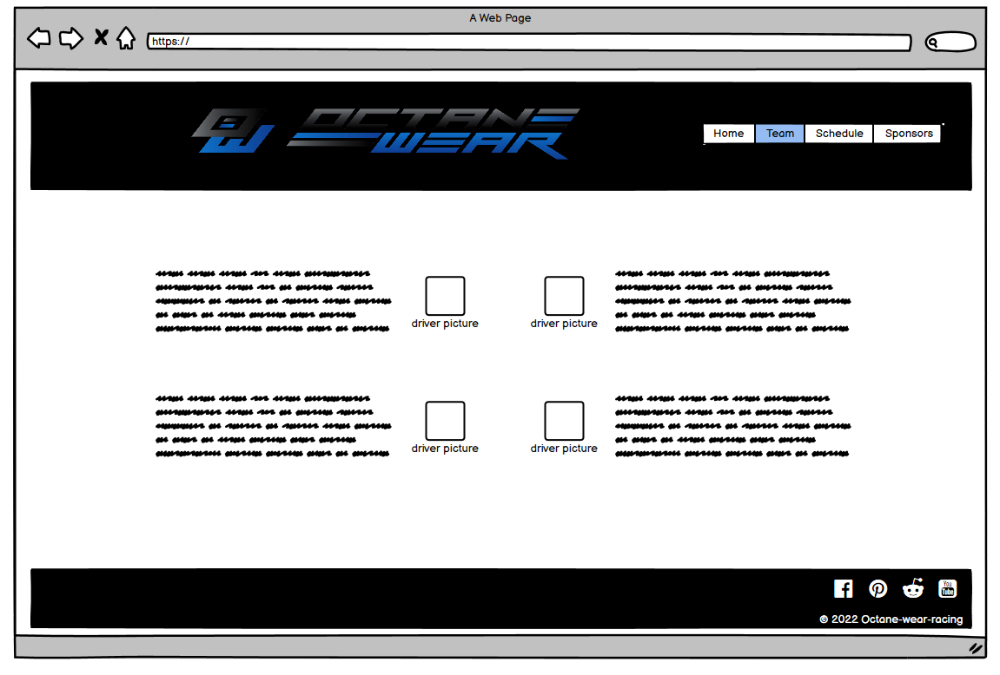

<h1  align="center"> OctaneWear Racing webiste </h1>

This is a first touch to inform fans of the Racing team about the current status of the series they are racing in, provide visitors with information on current sponsorships and easy to get information about the drivers as well as their licences and what series to follow for next race.

## User Experience (UX)

- ## Design:

- ### Color Scheme:

		Using a high contrast black and white with OctaneWear Blue Accents (#197BBD)

- ### Typography:

		Burlingame Regular as main font

		Nunito regular for Headings and highlighted text

- ### Imagery:

		Images and videos are very important and helps convey the message of Racing Team and what vehicles and race tracks are being raced.

  

## Wireframes

<h2  align="center"></h2>

<h2  align="center"></h2>

<h2  align="center"></h2>

<h2  align="center"></h2>

## Technologies used
 - HTML5
 - CSS3
 
 ### Frameworks, Libraries & Programs used
  1. Google Fonts were used to import the 'Burlingame' and 'Nunito' fonts into the style.css file which are used on all pages throughout the project.
  2. Photoshop was used to create the logo, resizing images and editing photos for the website.
  3. Balsamiq was used to create the wireframes during the design process.
  4. github is used to store the projects code after being pushed from GitPod.
  5. gitpod is used for writing all of the code and to push project into github
  6. fontawesome is used for social networks icons.

## Features

-   Responsive on all device sizes
    
-   Interactive elements