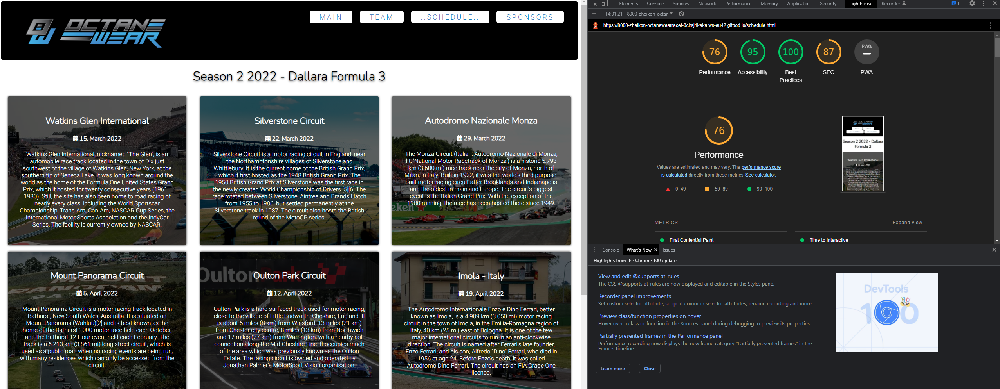

<h1  align="center"> OctaneWear Racing webiste </h1>

This is a first touch to inform fans of the Racing team about the current status of the series they are racing in, provide visitors with information on current sponsorships and easy to get information about the drivers and what series to follow for next race.

## User Experience (UX)

- ## Design:

- ### Color Scheme:

		Using a high contrast black and white with OctaneWear Blue Accents (#197BBD)

- ### Typography:

		Burlingame Regular as main font

		Nunito regular for Headings and highlighted text

- ### Imagery:

		Images and videos are very important and helps convey the message of Racing Team and what vehicles and race tracks are being raced.

  

## Wireframes

### Desktop View

<h2  align="center"></h2>

<h2  align="center"></h2>

<h2  align="center"></h2>

<h2  align="center"></h2>

### Mobile View

<h2  align="center"></h2>

<h2  align="center"></h2>

<h2  align="center"></h2>

<h2  align="center"></h2>

## Technologies used
 - HTML5
 - CSS3
 
 ### Frameworks, Libraries & Programs used
  1. Google Fonts were used to import the 'Burlingame' and 'Nunito' fonts into the style.css file which are used on all pages throughout the project.
  2. Photoshop was used to create the logo, resizing images and editing photos for the website.
  3. Balsamiq was used to create the wireframes during the design process.
  4. github is used to store the projects code after being pushed from GitPod.
  5. gitpod is used for writing all of the code and to push project into github
  6. fontawesome is used for social networks icons.
  7. iRacing was used to take pictures from for Carousel and across the website.

## Features

-   Responsive on all device sizes
    
-   Interactive elements

## References and sources

-   ~~Carousel made following a tutorial from w3nebie on youtube: https://www.youtube.com/watch?v=pGHOaY4dhAA~~ - this was later removed as it was difficult to incomporate into the design flow of the web.

-   Inspiration and some code used from Love Running part of training course at Code Institute: https://codeinstitute.net/ie/

-   W3 schools for a lot of CSS assists: https://www.w3schools.com/

## Testing

The W3C Markup Validator and W3C CSS Validator Services were used to validate every page of the project to ensure there were no syntax errors in the project.

- [CSS Validator](https://jigsaw.w3.org/css-validator/#validate_by_uri) 

    - [CSS](https://zheikon.github.io/octanewear_race_team/assets/img/readme/w3_validation/css.png)

- [HTML Validator](https://validator.w3.org/) 
    - [index](https://zheikon.github.io/octanewear_race_team/assets/img/readme/w3_validation/index.png) 
    - [team](https://zheikon.github.io/octanewear_race_team/assets/img/readme/w3_validation/team.png) 
    - [Schedule](https://zheikon.github.io/octanewear_race_team/assets/img/readme/w3_validation/schedule.png) 
    - [sponsors](https://zheikon.github.io/octanewear_race_team/assets/img/readme/w3_validation/sponsors.png)

- LightHouse - Part of Google Chrome

<h2  align="center"></h2>

<h2  align="center"></h2>

<h2  align="center"></h2>

<h2  align="center"></h2>

#### Testing user experience
-   As first time visitor, I want to be able to understand what this page is about.
    - On the landing page, a short description of what the page is about is greeting the visitors
    - Hero image shows right away visually what the content will be about
    - Visitors can go straight to the call to action by subscribing to a newsletter on the very main page
-   As first time visitor, easy navigation is important
    - The site has very easy to spot and navigate navbar on the top right corner
    - navbar had been made responsive and tested on various devices so it is easy to click each link in the navigation
-   As first time visitor, I want to be aware whre to follow the team
    - Links to various social media were added to the bottom of the page

### Further Testing

-   The Website was tested on Google Chrome,  Microsoft Edge and Brave Browsers
-   The website was viewed on a variety of devices such as Desktop, Laptop, Huawei P30 pro, Huawei P20, iPhone 11.
-   A large amount of testing was done to ensure that all pages were linking correctly.
-   Friends and family members were asked to review the site and documentation to point out any bugs and/or user experience issues.

### Known Bugs

- Some pages are receiving lower scores from Google Lighthouse for performance
- amiresponsive is showing overlapping elements on iphone device, yet google dev tools with showing the same phone shows this correctly. Tested on phone and was not able to replicate what amiresponsive shows.

### Resolved Bugs

- **Missing image in Schedule.html**
  - corrected by moving image to the correct folder

## Deployment

### GitHub Pages
## The project was deployed to GitHub Pages using the following steps...

1. Log in to GitHub and locate the [GitHub Repository](https://github.com/ZheikoN/octanewear_race_team)
2. At the top of the Repository (not top of page), locate the "Settings" Button on the menu.
    - Alternatively Click Here for a GIF demonstrating the process starting from Step 2.
3. Scroll down the Settings page until you locate the "GitHub Pages" Section.
4. Under "Source", click the dropdown called "None" and select "Master Branch".
5. The page will automatically refresh.
6. roll back down through the page to locate the now published site link in the "GitHub Pages" section.

## Credits

### __All images used are used for educational purposes and will NOT be used for any commercial use__

  - Images on index.html taken from Google Images search service
      - https://cutewallpaper.org/

  - Images on schedule.html taken from Google Images search service
      - https://en.wikipedia.org/wiki/2006_Brazilian_Grand_Prix
      - https://www.dailymail.co.uk/news/article-7545673/Rev-heads-dream-Home-Mt-Panorama-unrestricted-views-track-hammer.html
      - https://www.tripadvisor.ca/ShowUserReviews-g155032-d155363-r342944985-Circuit_Gilles_Villeneuve-Montreal_Quebec.html
      - https://game.raceroom.com/competitions/1331/leaderboard
      - https://www.motorsportmagazine.com/articles/single-seaters/f1/broken-radios-and-right-to-reverse-what-you-missed-from-the-2021-emilia-romagna-grand-prix
      - https://www.irishtimes.com/sport/fancy-a-trip-to-the-italian-grand-prix-at-monza-here-s-how-1.3997847
      - https://news.msv.com/british-gt-confirms-2022-calendar.aspx
      - http://151.80.200.53/poi/19182/Phillip-Island-Grand-Prix.html
      - https://www.racedepartment.com/downloads/road-atlanta-2017.18259/updates
      - https://silverstone-campsite.co.uk/f1-camping-will-there-be-silverstone-camping-in-2020/
      - https://nasaspeed.news/columns/the-motorsports-tourist/virginia-international-raceway-a-crown-jewel-of-the-east-coast-vir-plays-host-to-the-nasa-eastern-states-championships/
      - https://www.syracuse.com/sports/2021/08/skrewball-peanut-butter-whiskey-200-at-watkins-glen-international-872021-lineup-live-stream-tv-channel-how-to-watch-nascar-xfinity-series.html
      - 

  - Images on team.html taken from Google Images search service
      - VectorStock.com/168213 
      - http://hotcore.info/babki/Racing-Cartoon-Man.html
      - https://www.freepik.com/
      - https://www.alamy.com/

  - Images on sponsors.html received from appropriate parties and team members with exception of 2 placeholders taken on Google as an example
      - https://www.logolynx.com/topic/fake+company
      - https://www.nicepng.com/ourpic/u2w7w7q8q8i1q8t4_color-fake-company-logo-png/
  
  - Images on index.html are my own property, taken during a race in iRacing service
      - iracing.com
